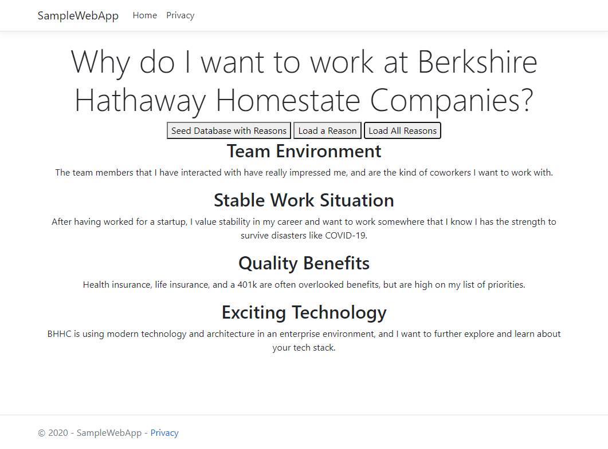

  <h3 align="center">BHHC Sample Project</h3>

  

    A REST API and Web Application designed to show off my skills with .NET CORE, EF Core, JavaScript, JQuery, Ajax, NUnit, and GitHub.
  

## Table of Contents

* [About the Project](#about-the-project)
  * [Built With](#built-with)
* [Usage](#usage)
* [Contact](#contact)
* [Acknowledgements](#acknowledgements)

## About The Project
As part of the interview process at Berkshire Hathaway Homestate Companies (BHHC) for the position of Senior Software Engineer, 
I was asked to create an example project to demonstrate my abilities as a developer. This is that project. It consists of an API
server built in .NET Core that collects and serves reasons that I would like to work for BHHC and a client web application that
seeds the database with a few reasons, and then requests and displays them.

### Built With
* [.NET Core](https://dotnet.microsoft.com/)
* [jQuery](https://jquery.com/)
* [jQuery UI](https://jqueryui.com/)
* [NUnit](https://nunit.org/)

## Usage

The "Seed Database with Reasons" button puts 4 reasons that I would like to work for BHHC into the database, and then the "Load a Reason" 
and "Load All Reasons" buttons display the reasons specified.

## Contact
Ben Vaughan - ben.vaughan01@gmail.com

Project Link: [https://github.com/benvaun/BHHCSampleApplication](https://github.com/benvaun/BHHCSampleApplication)

## Acknowledgements
I'd like to thank Berkshire Hathaway Homestate Companies for considering me for this position, and I'm looking forward to discussing this
project with your team!
